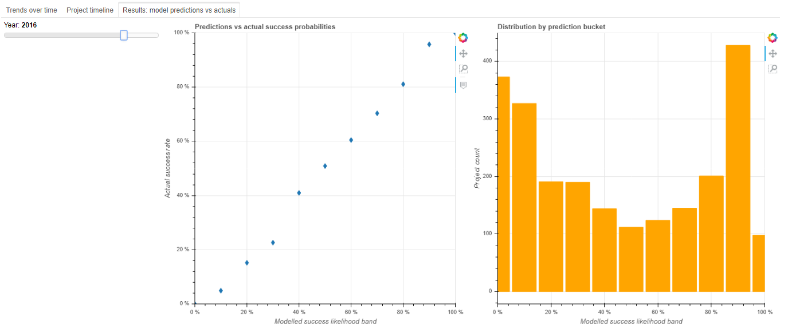

# Which Kickstarter projects are successful?

Full blog post: https://nycdatascience.com/blog/student-works/which-kickstarter-projects-reach-their-funding-goals/

## Questions

- What are the patterns of project success across time and categories?
- How likely is a given project to succeed? How would you design a project to maximise the chance of success?
- How much is likely to be raised? What goal should be set??

## Output

To launch the Bokeh application locally, please donwload the content in the Bokeh folder.

Then navigate to the folder where this is saved and use command prompt to run:

bokeh --serve main.py

